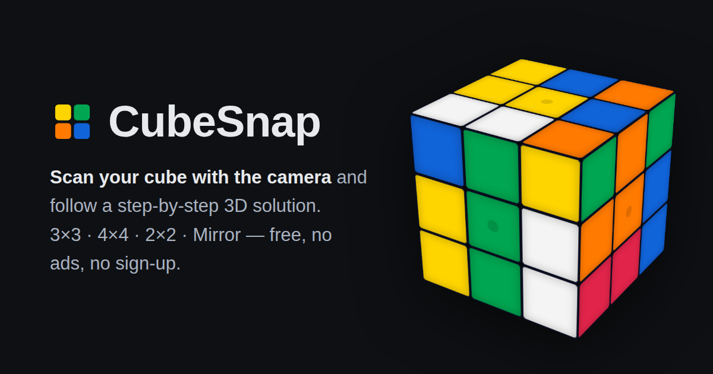

# CubeSnap

**[gjtucker.github.io/cube-solver](https://gjtucker.github.io/cube-solver/)** — a free Rubik's cube solver. No ads, no app, no sign-up.

Scan your cube with the camera and follow a step-by-step 3D solution, right in the browser. Installable as an app (Add to Home Screen) and works offline.



## What this is

Nothing here is a new idea. Cube solvers, camera scanners and 3D playback all
existed long before this project, and the algorithms it leans on are decades
old and published — the credits below name every one of them.

What CubeSnap tries to do is put those pieces together carefully: one page that
scans, solves, explains and animates, with no ads, no install prompt, no
account, and no waiting on a server. That's the whole pitch. If it's good, it's
good at execution, not invention.

## Features

- **Camera scanning** — roughly fill the on-screen guide square with each face and the scanner locks on automatically: position, size and tilt. The acquisition window is deliberately tight, which is what keeps busy backgrounds from stealing the lock. Works with stickered cubes and with gapless stickerless cubes, which have no seams — there it reads the corner notches where tiles meet. Auto-capture waits for a confident read; manual capture and undo are always available.
- **Four puzzles** — 3×3, 4×4, 2×2 and Mirror 2×2.
- **Two solving styles** — *Step-by-step* teaches the classic layer-by-layer method in stages, each with a "Why this works" explainer of the underlying idea (commutators, twist parity, 4×4 parities); *Fewest moves* looks for short solutions (two-phase for 3×3; the 4×4 reduces phase-by-phase and finishes with IDA\* over TPR-style pruning tables).
- **4×4 solving without a server** — the shipped lookup tables are 228 KB gzipped. The large pruning table for the exact search is too big to ship, so each Web Worker builds its own copy on device; that build is started when you open the 4×4 tab, so it is usually done before you ask for a solve, and it never blocks one. Typical result: around 46 moves in about a second, a couple fewer with "Search harder".
- **3D playback** — animated cube with play/pause, stepping, speed control, and per-stage move lists. Your cube and playback position survive refreshes.
- **2D net view** — a flat unfolded cross as an alternative to the 3D cube while painting; some people find it easier to copy a real cube face-by-face.
- **Pretty patterns** — checkerboard, cube-in-cube, superflip and friends, animated from a solved cube with the moves shown so you can follow along. Each algorithm is checked against the engine before it is offered. (Doing that turned up one thing worth knowing: a true checkerboard is impossible on the 2×2 and the 4×4.)
- **Share & copy** — share a link that reproduces your exact cube on any device; copy a solution's move sequence with one tap.
- **No build, no backend, nothing third-party** — plain HTML/CSS/JS served statically, with the one webfont vendored alongside it. The page never talks to another origin. Clone it and open `index.html`.

## Privacy

There is no backend, no analytics, no cookies and no accounts, so there is not
much to say — but the app asks for your camera, so it should say it plainly:

- **Camera frames never leave your device.** Scanning runs entirely in the page:
  a frame goes to a canvas, the scanner reads colours out of it, and what is
  kept is six grids of colour letters. No image is uploaded or saved anywhere.
  The camera is requested only when you tap Scan, and the stream is stopped when
  the scanner closes.
- **What is stored on your device** (`localStorage`, nowhere else): your painted
  cubes, the active tab, solve method, palette selection, playback speed and
  position, your theme, and whether the camera preview is mirrored. No
  identifiers, no history, nothing describing you. Clearing site data removes all
  of it.
- **Share links** carry the cube in the URL *fragment* (`#c=…`), which browsers
  never send to a server, and the app drops it from the address bar as soon as it
  has loaded.
- **The page makes no off-origin request at all.** Every byte — including the
  Inter webfont, which used to come from Google Fonts — is served from the same
  origin as the app, so no third party ever sees your IP or user agent. A
  Content-Security-Policy pins that shut: scripts may only load from this origin,
  and `connect-src 'self'` means there is nowhere for injected code to send
  anything even if some ever got in.

## Run locally

```sh
git clone https://github.com/gjtucker/cube-solver
cd cube-solver
python3 -m http.server 8000   # or any static server
# open http://localhost:8000
```

Opening `index.html` directly from `file://` also works (the 4×4 falls back to building its tables on-device).

## Development

Everything is plain scripts — no bundler, and nothing the browser downloads
comes from a package. `package.json` exists only for the two dev tools
(TypeScript for the type check, Playwright for the browser test); it is
`private`, its lockfile is committed so the toolchain is reproducible, and none
of it is shipped or bundled:

```sh
npm install     # dev tooling only — the app needs none of it
npm test        # typecheck + CSP check + colour, assignment, scanner and 4x4 harnesses
```

Types are checked without a build step: the shipped files carry JSDoc
annotations, cross-file globals are declared in `types.d.ts`, and
`npm run typecheck` (config in `jsconfig.json`) must come back clean — nothing
is compiled and nothing ships differently. The interesting parts:

| File | What it is |
|---|---|
| `scan.js` | Camera scanner: guide-anchored edge registration (live) and blob segmentation → lattice fitting (photo mode), plus HSV classification and the six-face colour assignment |
| `cube.js` | 3×3/2×2 engine + layer-by-layer and two-phase solvers |
| `cube4.js`, `tpr4.js`, `worker4.js` | 4×4 engine and phased-reduction solver: beam-portfolio fast path plus a deep engine (exact phase 3 by IDA\* over an edge-pairing permutation table, parity solved structurally) racing colour-axis rotations across workers |
| `tables/` | Pre-built solver tables (nibble-packed, gzipped); regenerate with `tools/gen-tables.mjs` |
| `app.js` | UI: painting, 3D rendering, playback, persistence, scanner overlay |
| `fonts/` | The vendored Inter subset and its OFL notice — the only third-party asset in the app |
| `tools/cube-corpus/` | Pipeline that turns openly-licensed cube photos into labelled scanner test scenes — real logos, gloss and worn stickers, which the synthetic harness cannot draw |

Both core pipelines have measurement harnesses with pass/fail targets, which is
where the real numbers live — quote those rather than anything in this file.
`npm test` runs the quick ones; individually:

```sh
node tests/scan-harness.mjs --seed 1     # scanner: lock rate / bad fits / false locks on synthetic scenes
node tests/scan-harness.mjs --corpus     # scanner: the same, on rectified photos of real cubes
node tests/hueclass-field.mjs            # colour classifier vs field-measured phone-camera pixels
node tests/solve4-harness.mjs            # 4×4 solver: move count + wall time
node tests/solve4-harness.mjs --hard     # the "Search harder" deep mode
node tests/browser-worker-test.mjs       # the real-browser worker path (needs playwright)
node tests/csp-hash-check.mjs            # CSP still pins the inline scripts; nothing off-origin crept back
```

`--corpus` needs a corpus first; see [`tools/cube-corpus/`](tools/cube-corpus/README.md),
which finds openly-licensed cube photographs, rectifies each face to a canonical
crop, and lets the harness composite those real textures into scenes with exact
ground truth. It scores the colour read as well as the fit, because a logo
printed on a centre cap breaks the read long before it breaks the geometry.

## Themes

CubeSnap follows your system's light/dark preference; the toggle in the header (persisted per browser) or `?theme=dark` / `?theme=light` in the URL overrides it.

## Credits

Essentially all of the cube theory here is borrowed. **No third-party code is
copied into this repository** — each algorithm below was implemented from its
published description — but the ideas are other people's, and the credit is
theirs.

- **[Herbert Kociemba](http://kociemba.org/cube.htm)** — the two-phase algorithm behind the 3×3 *Fewest moves* solver (`cube.js`), which also finishes every 4×4 solution.
- **Morwen Thistlethwaite** — the nested-subgroup idea (solve into progressively smaller move groups so later phases cannot undo earlier ones) that the 4×4 phased reduction is built on.
- **Richard Korf** — IDA\*, the iterative-deepening A\* search the 4×4 deep engine runs over its pruning tables.
- **[Chen Shuang (cs0x7f)](https://github.com/cs0x7f/TPR-4x4x4-Solver)** — the Three-Phase-Reduction solver that generates official WCA 4×4 scrambles. CubeSnap's deep 4×4 engine follows its design; see the note below.
- **Charles Tsai** — the 8-step 4×4 method that TPR builds on.
- **The [speedsolving.com](https://www.speedsolving.com/) community** — the layer-by-layer method taught in *Step-by-step*, and the 4×4 OLL/PLL parity algorithms in `cube4.js`.
- **David Singmaster** — the U/D/F/B/R/L face-turn notation used throughout the app and this codebase.
- **The cubing community's pattern folklore** — checkerboard, cube-in-cube, superflip and the other classics in the pattern library are traditional algorithms of unknown or collective authorship (superflip's fame dates to Michael Reid's 1995 proof that it needs 20 moves); each one is re-verified against the engine before it is shown.

The camera scanner (`scan.js`) was written for this project out of standard
computer-vision building blocks — edge-profile registration, blob segmentation,
lattice fitting, HSV classification — rather than from an existing scanner
implementation. That is a statement about provenance, not about novelty: they
are textbook parts, assembled for this particular problem.

### On the 4×4 deep engine and TPR

[TPR-4x4x4-Solver](https://github.com/cs0x7f/TPR-4x4x4-Solver) is GPL-licensed Java. CubeSnap's deep engine is an independent JavaScript implementation, written from a prose description of TPR's *algorithm* — its phase structure, the relative-pairing edge coordinate, and the idea of folding parity into the pruning coordinates so parity is never repaired by a dedicated 15-move algorithm. No TPR source was copied. The two implementations diverge, though mostly because a browser imposes different constraints than a desktop JVM:

| | TPR | CubeSnap |
|---|---|---|
| Edge pruning table | 31M entries × 2 bits, 8-fold symmetry reduction, depth 9 | 239.5M entries × 2 bits, direct-indexed by even-permutation rank, depth 9 (no symmetry reduction) |
| Phase-2 goal | centers + wing parity; phase-3 feasibility filtered afterwards | centers, parity **and** phase-3 feasibility searched jointly as one exact-depth problem |
| 3×3 finish | min2phase | CubeSnap's own two-phase solver (`cube.js`) |
| Orientation | one symmetry frame, rotations stripped at output | three color-axis rotations raced across Web Workers |

Copyright covers the expression of a program rather than the algorithm it implements, so an independent reimplementation like this one could carry a permissive license. This project uses the GPL anyway: the deep engine's design owes enough to TPR that the conservative choice is to license under the same terms as the work that inspired it, so there is no doubt in any reading. TPR is also simply the better solver — it reaches ~44.4 moves in ~250 ms against our ~44.1 in ~12 s, on a fraction of the memory — and it is the reference this one was measured against throughout.

### Assets and tooling

- **[Inter](https://rsms.me/inter/)** by Rasmus Andersson, under the [SIL Open Font License 1.1](https://openfontlicense.org/) — vendored in `fonts/` (latin subset, variable weight) rather than fetched from Google Fonts, so the app makes no off-origin request. The OFL requires its notice to travel with the font: it is in [`fonts/LICENSE-Inter.txt`](fonts/LICENSE-Inter.txt), and it covers the font only — the rest of CubeSnap stays GPL-3.0-or-later. See [`fonts/README.md`](fonts/README.md) for provenance and how to update it.
- **[Playwright](https://playwright.dev/)** (Apache-2.0) — an optional dev dependency for `tests/browser-worker-test.mjs` only; installed ad hoc (`npm install playwright --no-save`), never bundled. The app ships no third-party *code* at all: the font is the only vendored asset.

## License

[GPL-3.0-or-later](LICENSE) © 2026 CubeSnap contributors.

CubeSnap is free software: you can redistribute it and/or modify it under the terms of the GNU General Public License as published by the Free Software Foundation, either version 3 of the License, or (at your option) any later version. It is distributed in the hope that it will be useful, but **without any warranty** — see the [LICENSE](LICENSE) file for details. Since the site is served unbuilt, the deployed files *are* the complete corresponding source.
